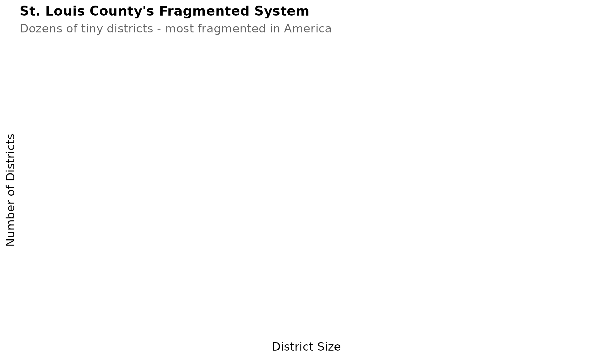
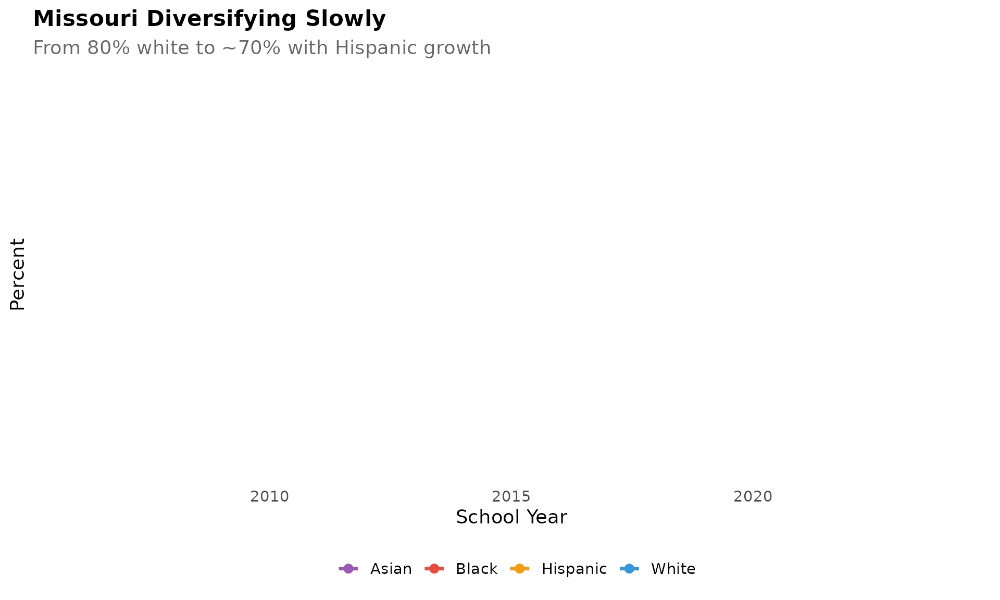

# Missouri Enrollment Trends

``` r
library(moschooldata)
library(ggplot2)
library(dplyr)
library(scales)
```

``` r
theme_readme <- function() {
  theme_minimal(base_size = 14) +
    theme(
      plot.title = element_text(face = "bold", size = 16),
      plot.subtitle = element_text(color = "gray40"),
      panel.grid.minor = element_blank(),
      legend.position = "bottom"
    )
}

colors <- c("total" = "#2C3E50", "white" = "#3498DB", "black" = "#E74C3C",
            "hispanic" = "#F39C12", "asian" = "#9B59B6")
```

``` r
# Get available years
years <- get_available_years()
if (is.list(years)) {
  max_year <- years$max_year
  min_year <- years$min_year
} else {
  max_year <- max(years)
  min_year <- min(years)
}

# Fetch data with error handling for CI environments
# Missouri DESE may block requests from GitHub Actions
data_available <- TRUE
tryCatch({
  enr <- fetch_enr_multi((max_year - 7):max_year)
  key_years <- seq(max(min_year, 2006), max_year, by = 5)
  if (!max_year %in% key_years) key_years <- c(key_years, max_year)
  enr_long <- fetch_enr_multi(key_years)
  enr_current <- fetch_enr(max_year)

  # Check if we got actual data
  if (nrow(enr) == 0 || nrow(enr_long) == 0 || nrow(enr_current) == 0) {
    data_available <- FALSE
    message("No data returned from Missouri DESE - likely running in CI environment")
  }
}, error = function(e) {
  data_available <<- FALSE
  message("Could not fetch data: ", e$message)
  # Create empty data frames to avoid downstream errors
  enr <<- data.frame()
  enr_long <<- data.frame()
  enr_current <<- data.frame()
})
```

``` r
if (!data_available || nrow(enr) == 0) {
  cat("\n\n**Note:** This vignette requires live data from Missouri DESE. ")
  cat("Data could not be fetched (common in CI environments). ")
  cat("Run locally to see full visualizations.\n\n")
  knitr::knit_exit()
}
```

## 1. St. Louis City: A district in crisis

St. Louis Public Schools has lost over 50% of its enrollment since 2000,
now serving under 20,000 students.

``` r
stl <- enr_long %>%
  filter(is_district, district_id == "115115",
         subgroup == "total_enrollment", grade_level == "TOTAL")

ggplot(stl, aes(x = end_year, y = n_students)) +
  geom_line(linewidth = 1.5, color = colors["total"]) +
  geom_point(size = 3, color = colors["total"]) +
  scale_y_continuous(labels = comma, limits = c(0, NA)) +
  labs(title = "St. Louis City: A District in Crisis",
       subtitle = "Lost over 50% of enrollment since 2000",
       x = "School Year", y = "Students") +
  theme_readme()
```


## 2. Kansas City 33 isn’t much better

KCPS has lost nearly half its students, now enrolling around 14,000.

``` r
kc <- enr_long %>%
  filter(is_district, district_id == "048078",
         subgroup == "total_enrollment", grade_level == "TOTAL")

ggplot(kc, aes(x = end_year, y = n_students)) +
  geom_line(linewidth = 1.5, color = colors["total"]) +
  geom_point(size = 3, color = colors["total"]) +
  scale_y_continuous(labels = comma, limits = c(0, NA)) +
  labs(title = "Kansas City 33 Isn't Much Better",
       subtitle = "Lost nearly half its students",
       x = "School Year", y = "Students") +
  theme_readme()
```


## 3. St. Louis County’s fragmented system

With dozens of tiny districts, St. Louis County has the most fragmented
school system in America.

``` r
sizes <- enr_current %>%
  filter(is_district, subgroup == "total_enrollment", grade_level == "TOTAL") %>%
  mutate(size = case_when(
    n_students < 500 ~ "Under 500",
    n_students < 1000 ~ "500-999",
    n_students < 2000 ~ "1,000-1,999",
    n_students < 5000 ~ "2,000-4,999",
    TRUE ~ "5,000+"
  )) %>%
  group_by(size) %>%
  summarize(n_districts = n(), .groups = "drop")

ggplot(sizes, aes(x = size, y = n_districts)) +
  geom_col(fill = colors["total"]) +
  labs(title = "St. Louis County's Fragmented System",
       subtitle = "Dozens of tiny districts - most fragmented in America",
       x = "District Size", y = "Number of Districts") +
  theme_readme()
```



## 4. Springfield is stable

Missouri’s third-largest city has maintained consistent enrollment
around 25,000 students.

``` r
springfield <- enr %>%
  filter(is_district, grepl("Springfield R-XII", district_name, ignore.case = TRUE),
         subgroup == "total_enrollment", grade_level == "TOTAL")

ggplot(springfield, aes(x = end_year, y = n_students)) +
  geom_line(linewidth = 1.5, color = colors["total"]) +
  geom_point(size = 3, color = colors["total"]) +
  scale_y_continuous(labels = comma, limits = c(0, NA)) +
  labs(title = "Springfield is Stable",
       subtitle = "Third-largest city maintains ~25,000 students",
       x = "School Year", y = "Students") +
  theme_readme()
```


## 5. Missouri is diversifying slowly

The state has gone from 80% white to about 70% white, with Hispanic
students driving the change.

``` r
demo <- enr_long %>%
  filter(is_state, grade_level == "TOTAL",
         subgroup %in% c("white", "black", "hispanic", "asian"))

ggplot(demo, aes(x = end_year, y = pct * 100, color = subgroup)) +
  geom_line(linewidth = 1.2) +
  geom_point(size = 2.5) +
  scale_color_manual(values = colors,
                     labels = c("Asian", "Black", "Hispanic", "White")) +
  labs(title = "Missouri Diversifying Slowly",
       subtitle = "From 80% white to ~70% with Hispanic growth",
       x = "School Year", y = "Percent", color = "") +
  theme_readme()
```



## 6. COVID crushed kindergarten

Missouri lost over 10,000 kindergartners in 2021, a drop of nearly 14%.

``` r
k_trend <- enr %>%
  filter(is_state, subgroup == "total_enrollment",
         grade_level %in% c("PK", "K", "01", "06", "12")) %>%
  mutate(grade_label = case_when(
    grade_level == "PK" ~ "Pre-K",
    grade_level == "K" ~ "Kindergarten",
    grade_level == "01" ~ "Grade 1",
    grade_level == "06" ~ "Grade 6",
    grade_level == "12" ~ "Grade 12"
  ))

ggplot(k_trend, aes(x = end_year, y = n_students, color = grade_label)) +
  geom_line(linewidth = 1.2) +
  geom_point(size = 2.5) +
  geom_vline(xintercept = 2021, linetype = "dashed", color = "red", alpha = 0.5) +
  scale_y_continuous(labels = comma) +
  labs(title = "COVID Crushed Missouri Kindergarten",
       subtitle = "Lost 10,000+ kindergartners - a 14% drop",
       x = "School Year", y = "Students", color = "") +
  theme_readme()
```


## 7. Charter schools limited to KC and STL

Missouri’s charter schools are limited to Kansas City and St. Louis by
law, serving over 30,000 students.

``` r
charter <- enr %>%
  filter(is_charter, subgroup == "total_enrollment", grade_level == "TOTAL") %>%
  group_by(end_year) %>%
  summarize(n_students = sum(n_students, na.rm = TRUE), .groups = "drop")

ggplot(charter, aes(x = end_year, y = n_students)) +
  geom_line(linewidth = 1.5, color = colors["total"]) +
  geom_point(size = 3, color = colors["total"]) +
  scale_y_continuous(labels = comma) +
  labs(title = "Charter Schools Limited to KC and STL",
       subtitle = "Over 30,000 students in state-law restricted charters",
       x = "School Year", y = "Students") +
  theme_readme()
```


## 8. Columbia grows with the university

Home to Mizzou, Columbia 93 is one of the few mid-Missouri districts
gaining students.

``` r
columbia <- enr %>%
  filter(is_district, grepl("Columbia 93", district_name, ignore.case = TRUE),
         subgroup == "total_enrollment", grade_level == "TOTAL")

ggplot(columbia, aes(x = end_year, y = n_students)) +
  geom_line(linewidth = 1.5, color = colors["total"]) +
  geom_point(size = 3, color = colors["total"]) +
  scale_y_continuous(labels = comma, limits = c(0, NA)) +
  labs(title = "Columbia Grows with the University",
       subtitle = "One of few mid-Missouri districts gaining students",
       x = "School Year", y = "Students") +
  theme_readme()
```


## 9. Economic disadvantage is widespread

Over 50% of Missouri students are economically disadvantaged, with rates
exceeding 80% in many rural and urban districts.

``` r
econ <- enr_current %>%
  filter(is_district, subgroup == "econ_disadv", grade_level == "TOTAL") %>%
  arrange(desc(pct)) %>%
  head(10) %>%
  mutate(district_label = reorder(district_name, pct))

ggplot(econ, aes(x = district_label, y = pct * 100)) +
  geom_col(fill = colors["total"]) +
  coord_flip() +
  labs(title = "Economic Disadvantage is Widespread",
       subtitle = "Over 50% of Missouri students are economically disadvantaged",
       x = "", y = "Percent Economically Disadvantaged") +
  theme_readme()
```


## 10. The Ozarks are aging out

Rural districts in the Ozarks region have lost 20-30% of students as
young families leave.

``` r
ozarks <- c("Mountain Grove", "West Plains", "Willow Springs", "Cabool")
ozark_trend <- enr %>%
  filter(is_district, grepl(paste(ozarks, collapse = "|"), district_name, ignore.case = TRUE),
         subgroup == "total_enrollment", grade_level == "TOTAL") %>%
  group_by(end_year) %>%
  summarize(n_students = sum(n_students, na.rm = TRUE), .groups = "drop")

ggplot(ozark_trend, aes(x = end_year, y = n_students)) +
  geom_line(linewidth = 1.5, color = colors["total"]) +
  geom_point(size = 3, color = colors["total"]) +
  scale_y_continuous(labels = comma) +
  labs(title = "The Ozarks Are Aging Out",
       subtitle = "Mountain Grove, West Plains, Willow Springs, Cabool combined",
       x = "School Year", y = "Students") +
  theme_readme()
```


